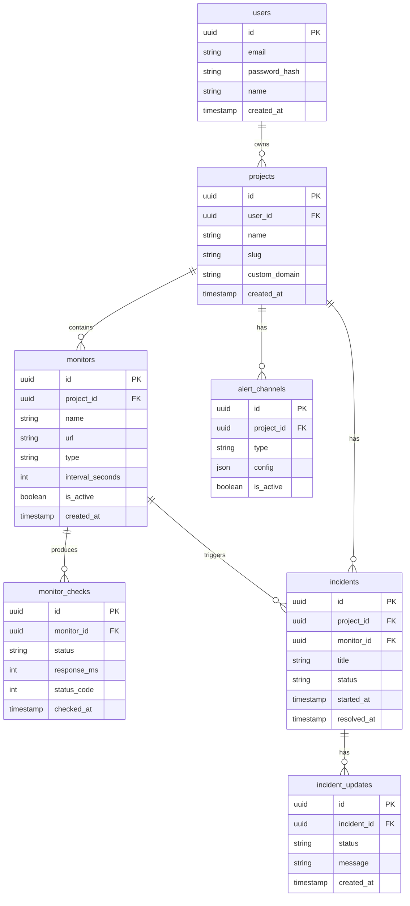

Oke, DB + API design. Gw akan pecah jadi dua bagian — schema dulu, lalu API endpoints.
Database schema
Ini ERD lengkap untuk StatusPilot:

Tiga keputusan penting di schema ini yang perlu lo pahami:
monitor_checks adalah tabel yang paling besar dan paling kritis. Setiap monitor yang cek setiap 1 menit akan generate 1440 row per hari. Kalau lo punya 50 monitor, itu 72.000 row/hari. Makanya tabel ini yang paling butuh TimescaleDB — lo akan set checked_at sebagai hypertable column, dan TimescaleDB otomatis partisi data per waktu sehingga query "uptime 30 hari" tetap cepat.
incidents dan monitors punya relasi terpisah ke projects. Incident bisa dipicu oleh monitor (otomatis saat downtime terdeteksi), tapi bisa juga dibuat manual oleh user. Makanya monitor_id di tabel incidents bisa null.
alert_channels pakai kolom config bertipe JSON. Ini supaya satu tabel bisa handle semua tipe channel — email, Slack webhook, Discord webhook — tanpa perlu tabel terpisah per channel type.

***

API design
Sekarang endpoints-nya:

Beberapa hal yang perlu lo perhatiin dari API design ini:
/status/:slug adalah satu-satunya endpoint yang public tanpa JWT. Ini penting — public status page harus bisa diakses siapa saja tanpa login, tapi semua endpoint admin harus protected. Lo harus buat middleware auth yang bisa dibedakan antara route protected dan public.
/monitors/:id/checks dan /monitors/:id/response-time adalah endpoint yang paling "expensive" dari sisi database. Ini yang akan query TimescaleDB dengan range waktu. Lo perlu tambahkan query parameter seperti ?from=&to=&interval=1h supaya frontend bisa request data yang spesifik untuk charting.
/alert-channels/:id/test itu endpoint kecil tapi sangat berguna untuk portfolio — lo bisa demo live bahwa notifikasi beneran nyampe ke Slack/Discord waktu interview. Recruiter suka hal yang bisa didemo langsung.
